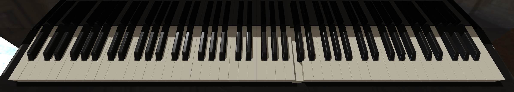
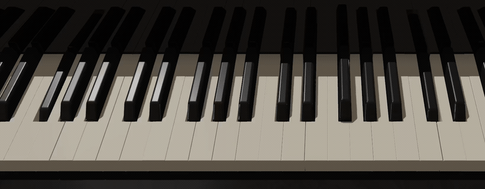

# piano-gl

A ready-to-use, high-performance C++ library for realistic 3D piano rendering and real-time key animation with modern OpenGL.

<p align="center">
  
</p>

## Features

- **Ready to Use Out of the Box**
  - Drop-in renderer with simple 3-function API: `init()`, `render()`, `noteOn()`/`noteOff()`
  - Includes high-quality piano model and HDR environment map
  - Beautiful results with zero configuration required

- **Highly Efficient Rendering**
  - Modern OpenGL 3.3+ with instanced rendering
  - Only 2 parametric key models for all 88 keys (white + black)
  - GPU-driven animation with per-instance transforms
  - Shadow mapping with configurable resolution

- **Physically-Based Rendering (PBR)**
  - Metallic-roughness workflow for realistic materials
  - HDR environment mapping for image-based lighting
  - Dynamic shadows with real-time updates
  - Reflection rendering on base plane

- **Simple Integration**
  - Header-only library with clean C++20 API
  - CMake build system with automatic dependency management
  - Cross-platform: Linux, macOS, Windows
  - Example application included

## Quick Start

### Prerequisites

- **C++17 compatible compiler** (GCC 9+, Clang 8+, MSVC 2017+)
- **CMake** 3.21 or newer
- **Python 3** (for shader embedding during build)
- **OpenGL 3.3+** capable graphics hardware

### Building

```bash
# Clone the repository
git clone https://github.com/dr-inf/piano-gl.git
cd piano-gl

# Configure and build
cmake -B build -S .
cmake --build build

# Run the example
./build/examples/keys_example/keys_example
```

The example application demonstrates the renderer with animated key presses.

Detailed example capture (click for MP4):

[](docs/media/demo_detail.mp4)

### Platform-Specific Build Instructions

<details>
<summary><b>Linux</b></summary>

**Ubuntu/Debian:**
```bash
# Install dependencies
sudo apt update
sudo apt install build-essential cmake python3 libgl1-mesa-dev libx11-dev libxrandr-dev libxinerama-dev libxcursor-dev libxi-dev

# Build
cmake -B build -S .
cmake --build build -j$(nproc)
```

**Fedora/RHEL:**
```bash
# Install dependencies
sudo dnf install gcc-c++ cmake python3 mesa-libGL-devel libX11-devel libXrandr-devel libXinerama-devel libXcursor-devel libXi-devel

# Build
cmake -B build -S .
cmake --build build -j$(nproc)
```
</details>

<details>
<summary><b>macOS</b></summary>

```bash
# Install dependencies via Homebrew
brew install cmake python3

# Build (use Ninja for faster builds)
cmake -B build -S . -G Ninja
cmake --build build

# Or with Xcode
cmake -B build -S . -G Xcode
open build/keys_project.xcodeproj
```

**Note:** macOS requires OpenGL 3.3+ Core Profile. The example automatically sets `GLFW_OPENGL_FORWARD_COMPAT` on macOS.
</details>

<details>
<summary><b>Windows</b></summary>

**Visual Studio 2019/2022:**
```cmd
# Open "x64 Native Tools Command Prompt"

# Configure
cmake -B build -S . -G "Visual Studio 17 2022" -A x64

# Build
cmake --build build --config Release

# Run
.\build\examples\keys_example\Release\keys_example.exe
```

**MinGW:**
```bash
# Install via MSYS2
pacman -S mingw-w64-x86_64-gcc mingw-w64-x86_64-cmake mingw-w64-x86_64-python3

# Build
cmake -B build -S . -G "MinGW Makefiles"
cmake --build build
```
</details>

## Usage

### Basic Example

```cpp
#include <keys/renderer.hpp>
#include <GLFW/glfw3.h>

int main() {
    // Initialize GLFW and create OpenGL 3.3+ context
    glfwInit();
    glfwWindowHint(GLFW_CONTEXT_VERSION_MAJOR, 3);
    glfwWindowHint(GLFW_CONTEXT_VERSION_MINOR, 3);
    glfwWindowHint(GLFW_OPENGL_PROFILE, GLFW_OPENGL_CORE_PROFILE);

    GLFWwindow* window = glfwCreateWindow(1920, 1080, "Piano", nullptr, nullptr);
    glfwMakeContextCurrent(window);

    // Load OpenGL functions (using GLAD, GLEW, or similar)
    gladLoadGLLoader((GLADloadproc)glfwGetProcAddress);

    // Initialize renderer (uses default assets)
    keys::Renderer renderer;
    keys::InitParams params;

    if (!renderer.init(params)) {
        return 1;  // Error details printed to stderr
    }

    // Render loop
    while (!glfwWindowShouldClose(window)) {
        int width, height;
        glfwGetFramebufferSize(window, &width, &height);

        keys::FrameParams frame;
        frame.fbWidth = width;
        frame.fbHeight = height;
        frame.timeSeconds = glfwGetTime();

        renderer.render(frame);

        glfwSwapBuffers(window);
        glfwPollEvents();
    }

    renderer.shutdown();
    glfwTerminate();
    return 0;
}
```

### Animating Keys

```cpp
// Trigger key press animation (pitch 21-108 for A0-C8)
renderer.noteOn(60);   // Middle C
renderer.noteOn(64); 
renderer.noteOn(67); 

// Release keys
renderer.noteOff(60);
renderer.noteOff(64);
renderer.noteOff(67);
```

The renderer automatically handles:
- Smooth key press/release animation
- Instanced rendering of all 88 keys from 2 base models
- Shadow updates during animation
- Per-key state management

### Configuration

```cpp
keys::InitParams params;
params.gltfPath = "assets/scene.gltf";                      // Piano model
params.envHdrPath = "assets/env/mirrored_hall_2k.hdr";     // HDR environment
params.shadowMapSize = 4096;                                // Shadow quality (1024-8192)
params.useKeyboardCamera = true;                            // Piano-optimized camera
params.useMovingCamera = false;                             // Animated orbiting camera

renderer.init(params);
```

**Shadow Quality:**
- `1024` - Low (mobile/integrated GPUs)
- `2048` - Medium (recommended for most hardware)
- `4096` - High (default, requires dedicated GPU)
- `8192` - Ultra (high-end GPUs only)

## Project Structure

```
keys/
├── include/keys/                     # Public API
│   └── renderer.hpp                  # Main renderer interface
├── src/                              # Implementation
│   ├── renderer.cpp                  # Renderer implementation (~1700 lines)
│   ├── log.hpp                       # Unified logging system
│   └── keys.hpp                      # MIDI note to key mapping
├── shaders/                          # GLSL shaders (embedded at build time)
│   ├── pbr.{vert,frag}               # PBR rendering with instancing
│   ├── shadow_depth.*                # Shadow map generation
│   ├── skybox.*                      # Environment skybox
│   └── equirect_to_cube.*            # HDR environment conversion
├── assets/                           # Ready-to-use assets included
│   ├── scene.gltf                    # Piano key model (black and white key)
│   ├── piano.blend                   # Blender source file
│   └── env/mirrored_hall_2k.hdr      # HDR environment (CC0)
├── examples/                         # 
│   └── keys_example/                 # Example with OpenGL context and MIDI playback (for animation only)
└── cmake/                            # Build scripts
```

## Dependencies

All dependencies are automatically fetched via CMake `FetchContent`:

| Library | Version | License | Purpose |
|---------|---------|---------|---------|
| [fastgltf](https://github.com/spnda/fastgltf) | v0.8.0 | MIT | Model loading |
| [GLM](https://github.com/g-truc/glm) | 0.9.9.8 | MIT / Happy Bunny | Mathematics |
| [stb_image](https://github.com/nothings/stb) | v2.30 | Public Domain / MIT | Image loading |

**Example only** (not required for library integration):
- [GLFW](https://github.com/glfw/glfw) 3.3.9 (zlib) - Windowing
- [GLAD](https://github.com/Dav1dde/glad) v0.1.36 (MIT) - OpenGL loader

See [THIRD_PARTY_LICENSES.md](THIRD_PARTY_LICENSES.md) for full license texts.

## Technical Details

### Rendering Pipeline

1. **Shadow Pass**: Render depth map from light's perspective
2. **Main Pass**: PBR rendering with shadows and IBL
3. **Reflection Pass**: Render mirrored keyboard on base plane

### Instanced Rendering

The renderer uses only **2 base meshes** (white key + black key) and renders all 88 keys using instanced drawing:

```glsl
// Per-instance attributes uploaded to GPU
layout(location = 5) in float instancePressed;  // Animation state (0.0-1.0)
layout(location = 6) in int instanceKeyIndex;   // Key index for positioning
layout(location = 7) in float instanceY;        // Base Y position
```

This approach:
- Minimizes memory usage (~40 KB for all keys vs. 3.5 MB for individual meshes)
- Reduces draw calls (2 instanced draws vs. 88 individual draws)
- Enables efficient GPU-driven animation

### Assets

All included assets are freely licensed:
- **Piano Model**: Created by dr-inf (Florian Krohs), MIT License
- **HDR Environment**: "Mirrored Hall" from [Polyhaven](https://polyhaven.com/a/mirrored_hall), CC0 Public Domain

See [assets/README.md](assets/README.md) for details and how to use custom assets.

## Integration Guide

For detailed integration instructions, see [USAGE.md](USAGE.md).

Quick integration via CMake:

```cmake
# Add as subdirectory
add_subdirectory(external/keys)

# Your executable
add_executable(my_app main.cpp)
target_link_libraries(my_app PRIVATE keys)
```

Or via FetchContent:

```cmake
include(FetchContent)
FetchContent_Declare(keys
    GIT_REPOSITORY https://github.com/dr-inf/piano-gl.git
    GIT_TAG main
)
FetchContent_MakeAvailable(keys)

add_executable(my_app main.cpp)
target_link_libraries(my_app PRIVATE keys)
```

## Contributing

Contributions are welcome! Please see [CONTRIBUTING.md](CONTRIBUTING.md) for guidelines.

## Roadmap

Planned improvements for upcoming iterations:

- More renderer parameters for scene customization, including key length, key spacing, material tuning, and per-part colors
- Adjustable lighting and camera presets for product shots, keyboard-focused views, and presentation scenes
- Better integration hooks for host applications, such as resize handling, state queries, and richer runtime configuration
- More asset packs and example scenes, including alternative piano finishes and lighting environments
- More demo inputs beyond the built-in clip, with cleaner workflows for external MIDI and scripted playback

## License

This project is licensed under the **MIT License** - see the [LICENSE](LICENSE) file for details.

Commercial use is allowed. The main obligation under MIT is to keep the copyright notice and license text with any copies or substantial portions of the software you redistribute.

If you ship piano-gl in a product, the practical minimum is:

- Include the text from [LICENSE](LICENSE) somewhere in your distributed notices or third-party licenses
- Preserve the copyright notice for this project
- Preserve any required third-party notices for bundled dependencies you redistribute

Visible credit is appreciated, but not required under MIT. Keeping the copyright notice and license text in redistributed copies is the actual requirement.

### Third-Party Licenses

This project uses several open-source libraries. See [THIRD_PARTY_LICENSES.md](THIRD_PARTY_LICENSES.md) for their full license texts.

## Support

If this project is useful to you, you can support future work here:

[](https://buymeacoffee.com/dr_infantil)

## Credits

- **Environment Map**: "Mirrored Hall" from [Polyhaven](https://polyhaven.com/a/mirrored_hall) (CC0)
- **PBR Shaders**: Inspired by [LearnOpenGL PBR tutorial](https://learnopengl.com/PBR/Theory)

---


